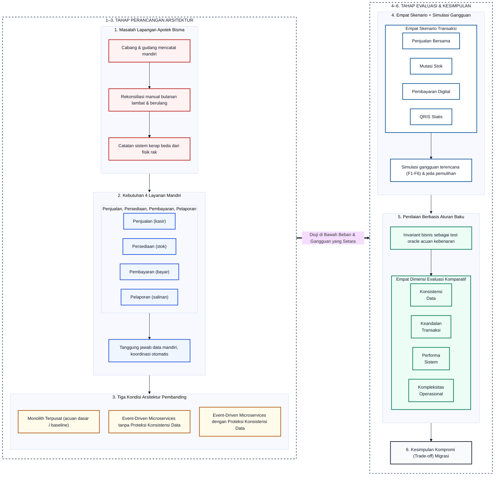

# BAB II KAJIAN PUSTAKA

## 2.1. Kajian Teori

### 2.1.1. Arsitektur Perangkat Lunak: dari Aplikasi Tunggal Menuju Layanan Terpisah

Arsitektur perangkat lunak adalah cara sebuah sistem disusun, yaitu bagian mana yang menangani fungsi apa dan bagaimana bagian-bagian itu saling berkomunikasi. Pilihan arsitektur menentukan seberapa mudah sistem dikembangkan, seberapa andal ia menghadapi gangguan, dan seberapa siap ia menampung pertumbuhan beban transaksi. Beberapa konsep arsitektur dan komunikasi berikut relevan bagi penelitian ini.

1. ***Monolith*** **Terpusat.** *Monolith* menempatkan seluruh fungsi sistem, mulai dari pencatatan transaksi kasir hingga pengelolaan stok, dalam satu aplikasi besar yang terhubung ke satu basis data bersama. Karena semua fungsi berbagi basis data yang sama, koordinasi antarfungsi menjadi sangat sederhana: perubahan yang saling berkaitan, seperti mencatat nota penjualan dan mengurangi stok barang, dapat diselesaikan sekaligus dalam **satu operasi penyimpanan basis data yang sama**. Hal ini membuat *monolith* cenderung lebih cepat dan efisien pada beban kerja tertentu (Blinowski et al., 2022). Namun, pemusatan seluruh beban pada satu pintu ini berisiko menciptakan antrean panjang dan kemacetan data ketika banyak cabang mengakses data yang sama secara bersamaan.
2. ***Microservices***. *Microservices* membagi sistem menjadi beberapa layanan mandiri berukuran lebih kecil berdasarkan fungsi bisnisnya, dengan setiap layanan mengelola basis datanya sendiri. Pada penelitian ini, empat fungsi utama Apotek Bisma yang telah dibatasi pada Bab I dipisahkan menjadi empat layanan:
   * **Layanan Penjualan (*Sales*):** Khusus mengelola transaksi kasir dan pesanan.
   * **Layanan Persediaan (*Inventory*):** Khusus menjadi pusat rujukan data stok fisik, stok yang sedang dipesan, dan mutasi barang.
   * **Layanan Pembayaran (*Payment*):** Khusus mencatat bukti dan status pembayaran.
   * **Layanan Pelaporan (*Reporting/Notification*):** Khusus mengolah salinan data untuk tampilan dasbor dan notifikasi tanpa berhak mengubah data transaksi utama secara langsung.
Pemisahan ini membuat tanggung jawab setiap bagian menjadi sangat jelas, meski di sisi lain memunculkan kebutuhan koordinasi antarlayanan yang sebelumnya tidak diperlukan pada *monolith*. Penelitian ini menguji langsung konsekuensi pemisahan tersebut pada konteks Apotek Bisma, alih-alih berasumsi bahwa memecah sistem menjadi banyak layanan pasti selalu lebih menguntungkan (Vera-Rivera et al., 2021).
3. **Komunikasi Berbasis Event (*Event-Driven Architecture*).** Ketika fungsi sistem sudah terpisah menjadi beberapa layanan, layanan-layanan itu tetap perlu saling memberi tahu ketika terjadi sesuatu yang relevan. Misalnya, layanan Persediaan perlu tahu saat ada penjualan baru agar stok barang dapat dikurangi. *Event-Driven Architecture* (EDA) adalah pola komunikasi yang menyampaikan pemberitahuan ini dalam bentuk kejadian (*event*). Alih-alih menerapkan komunikasi sinkron yang mengharuskan layanan Penjualan menunggu respons layanan Persediaan hingga berisiko memperlambat kasir, layanan Penjualan cukup menerbitkan *event* bahwa transaksi telah berhasil, lalu meneruskannya ke perantara pesan. Layanan Persediaan kemudian membaca pesan *event* tersebut secara mandiri untuk memotong stok. Pendekatan ini membuat sistem tetap responsif, tetapi memunculkan tantangan baru seperti pesan yang terlambat sampai, gagal terkirim, atau tidak sengaja terbaca dua kali (Karabey Aksakalli et al., 2021; Peczyński et al., 2025; Zuki et al., 2024).

---

### 2.1.2. Konsistensi Data pada Sistem yang Terpisah

Ketika seluruh fungsi berada dalam satu aplikasi dan satu basis data pada arsitektur *monolith* terpusat, satu transaksi penjualan dapat langsung memanfaatkan karakteristik transaksi ACID dari basis data relasional. Properti ACID ini mencakup empat aspek penting:

* ***Atomicity*** **(Keutuhan):** Memastikan seluruh rangkaian proses, seperti pencatatan nota sekaligus pemotongan stok, tuntas seutuhnya atau dibatalkan sama sekali jika terjadi kegagalan.
* ***Consistency*** **(Kesesuaian Aturan):** Memastikan data yang tersimpan selalu mematuhi seluruh batasan dan aturan bisnis yang sah.
* ***Isolation*** **(Pemisahan Transaksi):** Memastikan transaksi yang berjalan bersamaan tidak saling mengganggu atau membaca data yang belum selesai diproses.
* ***Durability*** **(Ketahanan Data):** Memastikan perubahan data yang sudah selesai tersimpan secara permanen walau sistem padam mendadak.

Persoalannya berubah begitu fungsi-fungsi itu dipisah ke layanan mandiri dengan basis data masing-masing pada arsitektur *microservices*. Satu proses penjualan kini melibatkan beberapa langkah pencatatan terpisah di komputer atau tabel yang berbeda. Karena tidak ada satu transaksi basis data tunggal yang mengunci seluruh layanan sekaligus, keadaan data antarlayanan dapat berbeda untuk sementara waktu. Contohnya, kasir sudah mencatat penjualan selesai, sementara pemotongan angka stok di sistem persediaan baru menyusul beberapa saat kemudian.

**Perlu ditegaskan, istilah "konsistensi data" yang menjadi fokus penelitian ini berbeda cakupan dari properti *Consistency* pada ACID di atas.** *Consistency* pada ACID berlaku dalam batas satu transaksi basis data tunggal, sedangkan konsistensi data yang dimaksud di sini adalah keadaan akhir data yang benar setelah dipertukarkan lintas beberapa layanan yang masing-masing memiliki basis data sendiri.

Perbedaan data sementara ini wajar terjadi pada sistem terdistribusi. Ukuran keberhasilan dalam penelitian ini bukan menuntut angka di seluruh layanan harus sama persis di setiap detik, melainkan apakah setelah seluruh pesan selesai diproses, data berakhir pada kondisi yang benar dan sesuai kenyataan. Inilah yang disebut *konsistensi data*.

Untuk memeriksa keabsahan data transaksi secara objektif, penelitian ini menggunakan *invariant bisnis*, yaitu aturan baku yang tidak boleh dilanggar setelah transaksi selesai diproses:

1. **Perhitungan Stok:** Stok yang siap dijual (*Available*) dihitung dari stok fisik di rak (*On-Hand*) dikurangi stok yang sedang direservasi atau menunggu pembayaran (*Reserved*).
2. **Stok Tidak Boleh Negatif:** Nilai stok yang siap dijual tidak boleh bernilai di bawah nol agar tidak terjadi penjualan barang fiktif (*oversell*).
3. **Kesesuaian Mutasi:** Saldo akhir stok fisik harus persis sama dengan saldo awal ditambah total penerimaan barang, lalu dikurangi total barang yang terjual, sebagai kriteria bahwa tidak ada data yang hilang tertimpa (*lost update*). Penerimaan barang tersebut mencakup pasokan dari pemasok di gudang pusat maupun distribusi antarcabang.
4. **Status Final Tidak Berubah:** Transaksi yang sudah resmi dibatalkan atau selesai tidak boleh berubah kembali menjadi aktif hanya karena ada pesan notifikasi lama yang terlambat datang.

---

### 2.1.3. Mekanisme Menjaga Konsistensi Data

Agar perbedaan data sementara tidak berubah menjadi kesalahan permanen saat terjadi gangguan jaringan atau transaksi yang bersamaan, dirancang paket proteksi konsistensi data yang mencakup lima mekanisme berikut.

1. ***Transactional Outbox*** **(Pencegah Kehilangan Pesan).** Risiko yang dicegah adalah data transaksi sudah tersimpan di kasir, tetapi aplikasi tiba-tiba mati sebelum sempat menerbitkan *event* ke bagian stok. Pola *Transactional Outbox* mengatasi hal ini dengan menambahkan sebuah tabel khusus bernama tabel *outbox* di dalam basis data layanan itu sendiri. Penyimpanan data penjualan dan penyimpanan pesan *event* ke tabel *outbox* dibungkus dalam satu transaksi lokal yang sama sehingga kedua operasi tersebut terikat secara atomik: berhasil seluruhnya atau dibatalkan seutuhnya. Komponen pembaca latar belakang (*outbox relay*) kemudian membaca tabel *outbox* dan otomatis meneruskannya ke perantara pesan. Richardson (2018) mendokumentasikan pola ini secara sistematis untuk konteks *microservices*.
2. ***Durable Inbox*** **dan** ***Idempotency*** **(Pencegah Efek Ganda).** Karena pesan dapat terkirim ulang akibat gangguan jaringan, layanan penerima berisiko memproses pesan yang sama berulang kali. *Idempotency* adalah prinsip memastikan pesan yang diterima lebih dari sekali tetap menghasilkan efek bisnis satu kali saja. Mekanisme *Durable Inbox* mencatat nomor identitas setiap pesan yang sudah pernah dikerjakan ke dalam tabel khusus. Jika pesan dengan identitas yang sama masuk kembali, sistem cukup mengabaikannya sehingga stok tidak terpotong dua kali untuk satu nota belanja yang sama. Yadav dan Mantri (2024) membahas pendekatan konsumen idempoten ini secara khusus.
3. ***Optimistic Concurrency Control*** **(Pencegah Rebutan Stok).** Mekanisme *Optimistic Concurrency Control* (OCC) menangani kondisi saat dua kasir berbeda menjual produk yang sama persis di detik yang bersamaan. Setiap transaksi membaca sisa stok beserta nomor versinya. Saat hendak menyimpan perubahan, sistem memeriksa apakah nomor versi tersebut masih sama. Jika nomor versi sudah berubah karena transaksi kasir lain berhasil lebih dulu, transaksi yang belakangan akan ditolak secara tertib. Hal ini mencegah dua kasir sama-sama merasa berhasil menjual barang yang sisa fisiknya hanya tinggal satu, tanpa harus mengunci sistem kasir lainnya. Kung dan Robinson (1981) pertama kali merumuskan metode optimistik tanpa penguncian ini secara formal.
4. ***Saga*** **dan Kompensasi (Pemulihan Transaksi Bertahap).** Ketika transaksi kasir memerlukan beberapa tahapan lintas layanan, misalnya membuat pesanan, mengamankan stok sementara, lalu menunggu pembayaran, pola *Saga* bertindak sebagai pemandu alur. Apabila salah satu tahapan mengalami kegagalan, seperti pembayaran digital yang kedaluwarsa atau ditolak, sistem segera menjalankan aksi kompensasi terencana untuk membalikkan perubahan sebelumnya, misalnya dengan melepaskan kembali cadangan stok yang sempat ditahan agar produk dapat kembali dipesan oleh pelanggan lain. Garcia-Molina dan Salem (1987) merumuskan model *saga* dengan transaksi kompensasi semantik, dan Nurdiansyah dan Fauzi (2025) membahas penerapannya pada arsitektur *microservices* berbasis *event*.
5. **Perantara Pesan dan Pengelolaan Kegagalan (*Broker*, *Retry*, *Dead-Letter Queue* / DLQ).** Pertukaran pesan asinkron antarlayanan menggunakan aplikasi perantara pesan (*message broker*) berupa RabbitMQ. Layanan pengirim menerbitkan pesan ke perantara, dan perantara meneruskannya ke antrean layanan tujuan. Untuk memperkuat keandalan pengiriman pesan asinkron:
   * Pengirim meminta konfirmasi tanda terima bahwa pesan sudah aman disimpan oleh perantara.
   * Penerima memberi laporan balik (*acknowledgement*) setelah selesai memproses pesan agar pesan boleh dihapus dari antrean.
   * Jika terjadi gangguan sesaat, sistem otomatis mencoba mengirim ulang (*retry*) beberapa kali secara berkala.
   * Jika pesan tetap gagal diproses setelah batas percobaan habis, pesan diamankan ke antrean khusus *Dead-Letter Queue* (DLQ) agar tidak menyumbat antrean lain dan dapat diperiksa secara terpisah.
Karabey Aksakalli et al. (2021) mengidentifikasi kebutuhan pola komunikasi andal antarlayanan *microservices*, termasuk perantara pesan dan penanganan kegagalan, dalam tinjauan sistematisnya.

---

### 2.1.4. Pengujian Keandalan: *Fault Injection* dan *Observability*

Untuk membuktikan apakah mekanisme proteksi di atas benar-benar bekerja, sistem perlu diuji dalam kondisi bermasalah. *Fault Injection* adalah teknik pengujian dengan memberikan gangguan operasional secara sengaja dan terencana, seperti mematikan layanan secara mendadak, menunda pengiriman pesan, mengirim pesan ganda, atau membuat transaksi berebut stok, untuk mengamati bagaimana sistem meresponsnya. Setelah gangguan dihentikan, sistem diberi *recovery window* untuk memulihkan datanya sendiri secara otomatis (definisi pada Bab III Tabel 3.1).

Agar seluruh proses pemulihan dapat dipantau secara transparan, diterapkan prinsip *observability* melalui pencatatan riwayat log terstruktur, pencatatan *timestamp*, dan pemberian kode pelacak unik (*correlation ID*) pada setiap transaksi. Melalui instrumen ini, penelitian dapat mengukur seberapa cepat sistem pulih kembali ke kondisi normal, seberapa banyak sumber daya komputasi yang dipakai, dan apakah pemulihan data berjalan otomatis atau masih memerlukan intervensi manusia.

---

## 2.2. Penelitian yang Relevan

Blinowski et al. (2022) membuktikan bahwa *monolith* dapat memiliki performa lebih unggul pada beban kerja tertentu karena tidak terbebani oleh jeda komunikasi jaringan antarlayanan. Söylemez et al. (2022) menyoroti tantangan nyata pada *microservices*, terutama terkait kerumitan konsistensi data dan pengelolaan operasional. Kedua temuan ini mendasari penetapan arsitektur *monolith* terpusat sebagai kondisi acuan dasar (*baseline*) untuk menakar biaya dan manfaat pemisahan layanan.

Faustino et al. (2024) menunjukkan bahwa proses migrasi menuju *microservices* membawa biaya penurunan performa dan kebutuhan penataan ulang kode yang cukup besar. Rochman dan Suartana (2026) menemukan bahwa EDA terbukti memangkas waktu proses pergudangan yang panjang, namun penguncian justru menjadi penghambat saat terjadi pembaruan stok yang padat. Temuan ini menjadi pijakan bagi penelitian untuk menguji penanganan perebutan stok menggunakan *Optimistic Concurrency Control* (OCC).

Rodrigues et al. (2025) melalui Systematic Literature Review (SLR) menegaskan pentingnya standarisasi simulasi beban transaksi dan kesetaraan alokasi perangkat keras agar perbandingan arsitektur berlangsung adil. Bação dan Guerreiro (2026) membedakan secara tegas persoalan konsistensi data dan konsistensi proses bisnis pada sistem berbasis *event*. Al-Said Ahmad dan Andras (2022) membuktikan keandalan teknik *fault injection* untuk menguji ketahanan layanan, sementara Hui et al. (2025) menekankan perlunya *test oracle* sebagai penentu benar atau salahnya data. Definisi *test oracle* ada pada Bab III Tabel 3.1.

Celah penelitian (*research gap*) yang dijawab adalah belum adanya evaluasi komparatif pada sistem apotek multicabang yang memisahkan secara tegas antara **konsekuensi dasar pemisahan layanan** dan **manfaat nyata dari paket proteksi konsistensi data** di bawah simulasi gangguan terkendali. Tidak satu pun studi pada Tabel 2.1 yang menguji domain persediaan apotek multicabang melalui perbandingan tiga kondisi arsitektur secara berpasangan, simulasi kegagalan operasional terencana yang mencakup gangguan pesan dan kegagalan komponen, serta evaluasi komprehensif pada empat dimensi sekaligus: konsistensi data, keandalan transaksi, performa sistem, dan kompleksitas operasional. Celah penelitian inilah yang dijawab secara empiris pada penelitian ini:

* ***Monolith* Terpusat:** Berfungsi sebagai *baseline* untuk mengukur performa sistem terpusat.
* ***Event-Driven Microservices* Tanpa Proteksi Konsistensi Data:** Berfungsi untuk mengamati dan mengukur risiko dasar dari desentralisasi data ketika layanan dipisah.
* ***Event-Driven Microservices* dengan Proteksi Konsistensi Data:** Menguji sejauh mana penambahan lima mekanisme proteksi konsistensi data menjaga keutuhan data dan keandalan transaksi.

Perbandingan antara *Monolith* Terpusat dan *Event-Driven Microservices* Tanpa Proteksi Konsistensi Data memperlihatkan konsekuensi dasar serta risiko dari pemisahan layanan. Perbandingan antara *Event-Driven Microservices* Tanpa Proteksi Konsistensi Data dan *Event-Driven Microservices* dengan Proteksi Konsistensi Data membuktikan manfaat nyata penambahan lima mekanisme proteksi konsistensi data. Sedangkan perbandingan menyeluruh antara *Monolith* Terpusat dan *Event-Driven Microservices* dengan Proteksi Konsistensi Data memberikan gambaran utuh mengenai untung-rugi (*trade-off*) migrasi arsitektur bagi Apotek Bisma.

**Tabel 2.1. Perbandingan Penelitian yang Relevan**

| Penelitian | Fokus Utama | Temuan Kunci | Posisi terhadap Penelitian Ini |
| --- | --- | --- | --- |
| Blinowski et al. (2022) | Monolith vs. Microservices | Monolith unggul pada beban tertentu karena ketiadaan beban komunikasi jaringan | Dasar penetapan monolith terpusat sebagai acuan awal pembanding |
| Söylemez et al. (2022) | Tantangan operasional microservices | Pengelolaan konsistensi data dan kerumitan operasi merupakan tantangan utama | Menguatkan perlunya evaluasi beban operasional di samping kecepatan sistem |
| Faustino et al. (2024) | Dampak migrasi sistem | Migrasi arsitektur membawa biaya penurunan kecepatan dan upaya penataan sistem | Menguatkan perlunya perbandingan langsung berbasis bukti sebelum migrasi |
| Rochman & Suartana (2026) | Penerapan EDA pada pergudangan | Komunikasi berbasis *event* memangkas waktu proses, namun penguncian data memicu kemacetan stok | Landasan penerapan kontrol konkurensi optimistik pada mutasi stok persediaan |
| Rodrigues et al. (2025) | Pengukuran performa microservices | Pengujian sistem menuntut standarisasi beban transaksi dan kesetaraan perangkat | Acuan pengendalian beban simulasi dan kesetaraan lingkungan pengujian |
| Bação & Guerreiro (2026) | Konsistensi pada sistem berbasis *event* | Konsistensi angka data dan konsistensi alur proses merupakan persoalan berbeda | Landasan perumusan kriteria konsistensi data dan keandalan transaksi |
| Al-Said Ahmad & Andras (2022) | Simulasi gangguan (*Fault Injection*) | Pemberian gangguan secara sengaja efektif menguji batas ketahanan sistem | Dasar penyusunan skenario simulasi gangguan dan prosedur pemulihan |
| Hui et al. (2025) | Pengujian sistem microservices | Verifikasi sistem terdistribusi membutuhkan aturan acuan kebenaran yang pasti | Acuan perumusan aturan bisnis persediaan sebagai penentu keabsahan data |

---

## 2.3. Kerangka Berpikir

Kerangka berpikir penelitian ini dibangun dari masalah operasional nyata di Apotek Bisma, yaitu pencatatan yang terpisah di masing-masing cabang dan gudang, durasi rekonsiliasi manual bulanan yang memakan waktu lama, serta catatan stok di sistem yang kerap berbeda dari stok fisik di rak. Masalah-masalah tersebut dianalisis urgensinya sehingga melahirkan kebutuhan sistem baru yang membagi tanggung jawab ke dalam empat layanan mandiri: Penjualan, Persediaan, Pembayaran, dan Pelaporan.

Untuk menguji apakah pemisahan layanan tersebut benar-benar memberikan manfaat nyata terhadap integritas transaksi dan sebanding dengan biaya operasional yang timbul, dirancang tiga kondisi arsitektur pembanding: *Monolith* Terpusat, *Event-Driven Microservices* Tanpa Proteksi Konsistensi Data, dan *Event-Driven Microservices* dengan Proteksi Konsistensi Data. Rincian operasional tiap kondisi disajikan pada Bab III.

Ketiga arsitektur ini diuji melalui empat skenario transaksi utama (*use cases*) yang mewakili aktivitas harian Apotek Bisma:

1. **Penjualan Bersamaan:** Menguji transaksi kasir yang berebut sisa stok produk yang sama secara serentak.
2. **Mutasi Stok:** Menguji pembaruan stok masuk, baik dari pasokan pemasok ke gudang pusat maupun distribusi antarcabang, yang terjadi hampir bersamaan dengan transaksi kasir yang sedang membaca atau mengurangi stok barang tersebut.
3. **Pembayaran Digital:** Menguji notifikasi pembayaran yang datang terlambat, terkirim ganda, atau gagal setelah stok dikunci sementara pada tahap reservasi.
4. **QRIS Statis:** Menguji verifikasi manual kasir yang disetujui setelah batas waktu tunggu reservasi sistem berakhir (*timeout*). Pembayaran Digital dan QRIS Statis tampak serupa karena sama-sama menguji keterlambatan konfirmasi pembayaran; perbedaan mekanisme keduanya dirinci pada Bab III sub-bab 3.2.4.

Keempat skenario tersebut dievaluasi baik dalam kondisi beban kerja normal maupun di bawah simulasi gangguan operasional (*fault injection*), dengan mengacu pada *invariant bisnis* sebagai tolok ukur keabsahan data. Hasil pengujian diukur secara komparatif pada empat dimensi: konsistensi data, keandalan transaksi, performa sistem, dan kompleksitas operasional, guna menarik kesimpulan kompromi (*trade-off*) yang objektif. Spesifikasi lengkap tiap skenario disajikan pada Bab III.

Secara ringkas, alur berpikir penelitian mengikuti urutan: masalah operasional lapangan -> analisis urgensi dan kebutuhan pemisahan layanan -> perancangan tiga arsitektur pembanding -> pengujian empat skenario transaksi dan simulasi gangguan -> penilaian keabsahan data berbasis invariant bisnis -> perbandingan empat dimensi evaluasi (konsistensi, keandalan, performa, dan kompleksitas operasional) -> penarikan kesimpulan kompromi (*trade-off*) migrasi. Gambar 2.1 merangkum alur ini.

Gambar 2.1. Kerangka berpikir penelitian