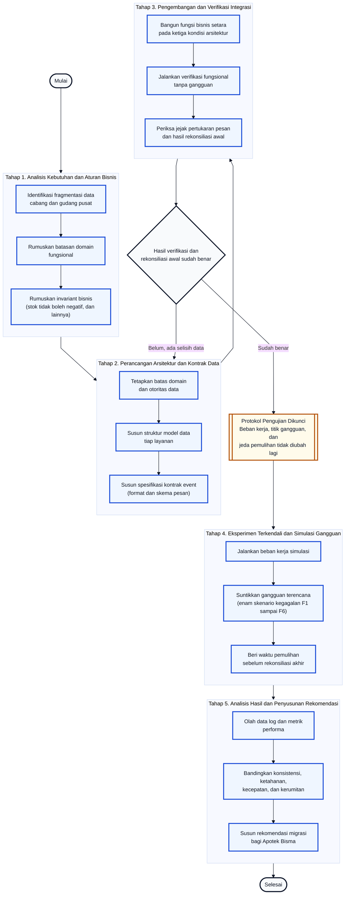
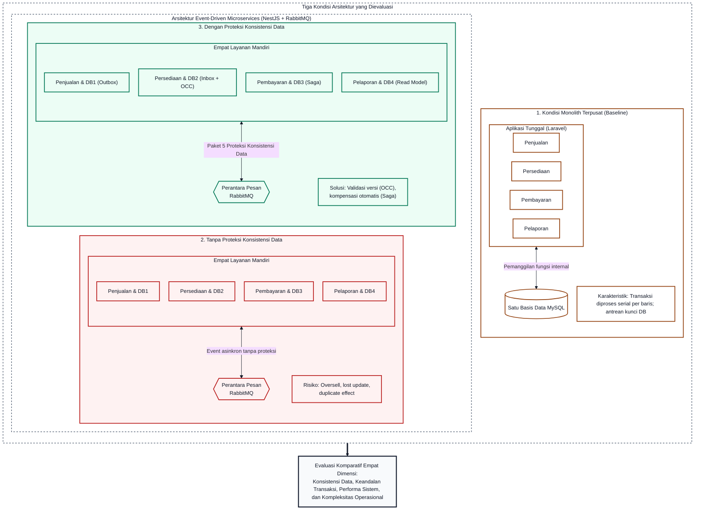
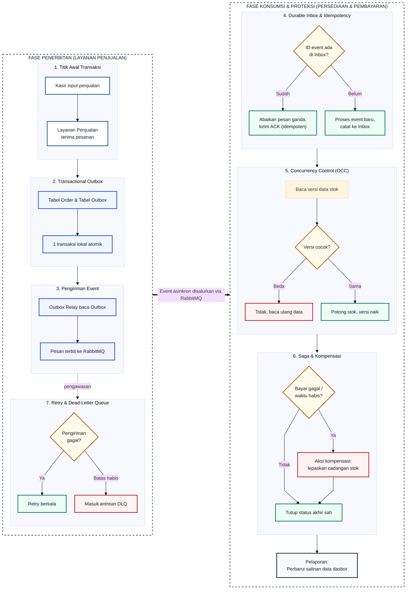
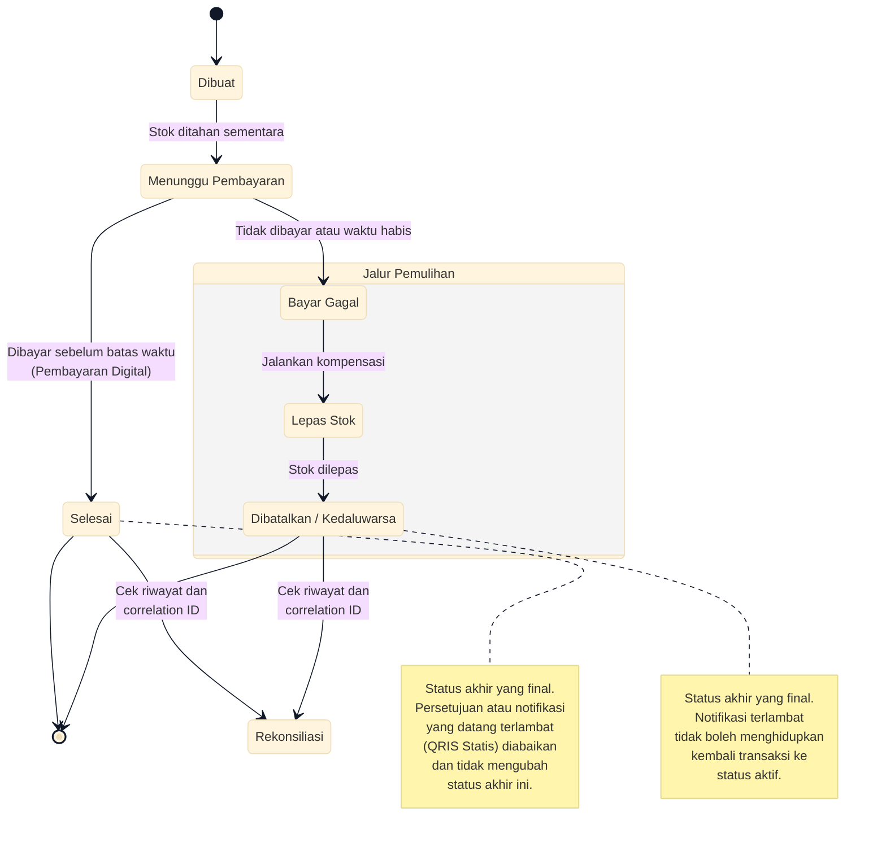

# BAB III METODE PENELITIAN

## 3.1. Jenis dan Pendekatan Penelitian

Penelitian ini merupakan rekayasa perangkat lunak terapan yang menggunakan pendekatan kuantitatif melalui eksperimen komparatif. Tiga rancangan arsitektur dibangun dengan fungsi bisnis yang setara, kemudian diuji berdampingan pada beban kerja dan gangguan yang sama untuk melihat bagaimana masing-masing menjaga konsistensi data, keandalan transaksi, performa, dan kompleksitas operasional.

Penelitian ini membandingkan tiga kondisi arsitektur yang berbeda dalam cara memisahkan tanggung jawab data dan menjaga konsistensinya.

**Kondisi pertama, Monolith Terpusat**, adalah kondisi ketika empat domain fungsional, yaitu empat area tanggung jawab data yang terdiri atas Penjualan, Persediaan, Pembayaran, dan Pelaporan, dijalankan sebagai satu aplikasi tunggal yang berbagi satu basis data secara langsung, tanpa pemisahan layanan maupun pertukaran pesan asinkron antarmodul. Susunan ini disebut arsitektur monolith terpusat, dan berperan sebagai acuan dasar (*baseline*) terpusat untuk mewakili pendekatan sentralisasi konvensional terhadap kondisi operasional Apotek Bisma.

**Kondisi kedua, *Event-Driven Microservices* Tanpa Proteksi Konsistensi Data**, adalah arsitektur *event-driven microservices*, yaitu arsitektur yang memisahkan sistem menjadi beberapa layanan mandiri yang saling memberi tahu perubahan data melalui pesan kejadian (*event*), bukan melalui satu basis data yang dipakai bersama. Pesan kejadian ini disalurkan melalui perantara pesan (*message broker*), yaitu perangkat lunak penengah yang meneruskan pesan dari layanan pengirim ke layanan penerima tanpa mengharuskan keduanya terhubung langsung. Pada kondisi ini, keempat domain fungsional dipisahkan ke dalam layanan mandiri yang saling bertukar event melalui perantara pesan tersebut tanpa mekanisme proteksi konsistensi data tambahan, guna mengamati risiko dasar dan anomali data yang timbul langsung dari pemisahan layanan.

**Kondisi ketiga, *Event-Driven Microservices* dengan Proteksi Konsistensi Data**, adalah arsitektur *event-driven microservices* dengan susunan layanan yang identik dengan kondisi kedua, dilengkapi lima mekanisme proteksi konsistensi data secara lengkap, yaitu:

- **Transactional** ***Outbox***, pola penyimpanan pesan kejadian dalam satu transaksi lokal bersama data bisnisnya, agar pesan tidak hilang meskipun layanan tiba-tiba berhenti sebelum sempat mengirimkannya.
- **Durable** ***Inbox*** **dan** ***Idempotency***, pencatatan identitas setiap pesan yang sudah diproses, agar pesan yang sama yang diterima berulang kali tidak menghasilkan efek bisnis lebih dari satu kali.
- ***Optimistic Concurrency Control* (OCC)**, pemeriksaan nomor versi data sebelum menyimpan perubahan, agar dua pembaruan yang terjadi hampir bersamaan tidak saling menimpa.
- ***Saga* dan Kompensasi**, tindakan pembalik otomatis yang dijalankan ketika salah satu tahap dalam transaksi lintas layanan gagal di tengah jalan, agar data kembali ke keadaan yang benar.
- ***Broker*, *Retry*, dan *Dead-Letter Queue* (DLQ)**, percobaan pengiriman ulang secara berkala ketika pesan gagal terkirim sementara, serta penampungan khusus bagi pesan yang tetap gagal setelah percobaan berulang habis, agar tidak menghambat antrean pesan lain.

Dengan susunan ini, perbedaan struktural antara kondisi *Monolith* Terpusat dan kedua kondisi *event-driven microservices* terletak pada ada tidaknya pemisahan layanan dan pertukaran event. Perbedaan antara kondisi *Event-Driven Microservices* Tanpa Proteksi Konsistensi Data dan kondisi *Event-Driven Microservices* dengan Proteksi Konsistensi Data terletak semata-mata pada ada tidaknya lima mekanisme proteksi konsistensi data tersebut, tanpa perbedaan fungsi bisnis apa pun di antara keduanya.

Empat domain fungsional yang sama berlaku pada ketiga kondisi arsitektur: domain Penjualan yang mengelola transaksi kasir dari awal hingga status akhir, domain Persediaan yang menjadi rujukan tunggal data stok sekaligus pemecah konflik perebutan stok, domain Pembayaran yang mencatat dan memvalidasi status setiap upaya pembayaran, serta domain Pelaporan yang menyediakan dasbor dan notifikasi tanpa berwenang mengubah data transaksi utama pada domain lain.

Cara keempat domain ini diwujudkan berbeda antarkondisi. Pada kondisi *Event-Driven Microservices* Tanpa Proteksi Konsistensi Data dan *Event-Driven Microservices* dengan Proteksi Konsistensi Data, keempat domain ini dibangun sebagai layanan mandiri yang saling bertukar event melalui perantara pesan. Pada kondisi *Monolith* Terpusat, keempat domain yang sama tetap dipertahankan sebagai modul internal pada satu aplikasi dan satu basis data, tanpa pemisahan layanan maupun pertukaran event. Kesetaraan fungsi bisnis pada tingkat domain inilah yang menjaga agar perbandingan ketiga kondisi arsitektur tetap adil.

Satu eksekusi pengujian pada satu kondisi arsitektur, dengan kombinasi skenario transaksi, beban kerja, dan gangguan tertentu, disebut satu **run**. Di dalam satu run, permintaan-permintaan yang datang hampir bersamaan saling memengaruhi karena berbagi kondisi data yang sama, misalnya dua kasir di cabang berbeda menjual satu botol obat terakhir, sehingga tiap permintaan tidak dapat dianggap sebagai sampel yang berdiri sendiri. Oleh sebab itu, yang dibandingkan antarkondisi arsitektur bukan hasil tiap permintaan secara terpisah, melainkan kondisi akhir satu run secara utuh, yaitu hasil rekonsiliasi data dan seluruh metrik setelah run tersebut selesai. Dengan demikian, run menjadi satuan analisis utama dalam penelitian ini.

Selain eksperimen utama, kesesuaian alur kerja diperiksa melalui validasi pengguna oleh pegawai cabang dan gudang Apotek Bisma sesuai peran masing-masing, yakni pencatatan penjualan dan pembayaran bagi kasir, serta penerimaan pasokan dan distribusi bagi staf gudang. Setiap peserta menjalankan tugas secara terbimbing; pendamping mencatat keberhasilan tugas, waktu, kesalahan, dan komentar melalui formulir validasi. Validasi ini berfungsi memeriksa kewajaran alur kerja operasional, sedangkan bukti ilmiah utama tetap bersumber dari eksperimen terkendali, *test oracle*, dan rekonsiliasi data.

Istilah kunci operasional yang digunakan sepanjang metode penelitian ini dirangkum pada Tabel 3.1.

**Tabel 3.1. Istilah Kunci Operasional pada Bab III**

| Istilah | Penjelasan |
| --- | --- |
| **Run** | Satu kali pengujian lengkap pada satu kondisi arsitektur, mulai dari reset data sampai rekonsiliasi akhir. Run menjadi satuan analisis utama. |
| **Blok replikasi** | Satu set run yang dijalankan dengan data awal, urutan permintaan, dan gangguan yang sama persis pada seluruh kondisi arsitektur yang relevan untuk satu kombinasi pengujian. Jumlah run dalam satu blok replikasi adalah tiga apabila kombinasi tersebut berlaku pada ketiga kondisi arsitektur, atau dua apabila gangguannya secara struktural hanya berlaku pada kedua kondisi *event-driven microservices*, sehingga hasil dalam satu blok replikasi tetap dapat dibandingkan secara berpasangan antarkondisi. |
| **Acknowledgement (ACK)** | Tanda terima yang dikirim layanan penerima setelah pesan selesai diproses, sebagai sinyal kepada perantara pesan bahwa pesan boleh dihapus dari antrean. Selama ACK belum diterima, perantara pesan akan mengirim ulang pesan yang sama. |
| **Correlation ID** | Kode unik yang mengikuti satu transaksi dari awal sampai akhir agar jejaknya dapat dilacak di semua layanan. |
| **Recovery window** | Jeda waktu tunggu tetap tanpa transaksi baru (ditetapkan sebesar 60 detik) setelah gangguan dihentikan, agar sistem sempat memulihkan diri sebelum hasil dicek; berbeda dari *recovery time* yang merupakan durasi aktual pemulihannya. |
| **Recovery time** | Durasi waktu nyata (dalam milidetik) sejak gangguan dihentikan hingga seluruh invariant dan data kembali memenuhi *test oracle*; berbeda dari *recovery window* yang merupakan batas durasi jeda pengujian. |
| **Terminal state** | Status akhir transaksi yang final (misalnya selesai atau dibatalkan) dan tidak boleh berubah lagi. |
| **Read-model lag** | Selisih waktu antara data berubah di layanan pemilik data dengan saat perubahan itu terlihat di layanan Pelaporan. |
| **Compensation success** | Proporsi keberhasilan aksi kompensasi otomatis dalam melepaskan cadangan stok tepat satu kali ketika transaksi pembayaran gagal atau kedaluwarsa. |
| **Test oracle** | Aturan pembanding yang ditetapkan sebelum eksperimen berjalan, digunakan untuk menentukan apakah hasil akhir suatu transaksi benar atau salah berdasarkan aturan bisnis (*invariant*). |
| **Kode gangguan (fault code)** | Kode singkat F1 sampai F6 yang mewakili enam skenario gangguan berbeda, yaitu event tertahan, pesan ganda, layanan penerima berhenti, keterlambatan pesan/status, konflik stok, dan kegagalan pembayaran setelah reservasi. |

---

## 3.2. Rancangan Penelitian dan Model Pengembangan Perangkat Lunak

Penelitian ini menyusun alur penelitian mandiri yang disesuaikan dengan kebutuhan pengembangan dan perbandingan tiga arsitektur. Alur tersebut meliputi tahapan pemahaman masalah, perancangan solusi, pembangunan sistem, pengujian, dan penarikan kesimpulan.

Gambar 3.1. Alur penelitian dan pengembangan sistem

Kelima tahap pada Gambar 3.1 berjalan berurutan dengan titik pemeriksaan dan titik penguncian protokol sebelum eksperimen utama dimulai. Peneliti kembali ke tahap perancangan apabila verifikasi integrasi menemukan selisih data pada rekonsiliasi awal. Setelah protokol pengujian dikunci, seluruh parameter perlakuan tidak diubah lagi; apabila terdapat perubahan yang memengaruhi perilaku perlakuan, run terkait wajib diulang. Tahapan dan luaran tiap fase penelitian dirangkum pada Tabel 3.2, sedangkan rincian dan definisi operasional enam skenario gangguan F1 sampai F6 disajikan secara formal sebelum Tabel 3.6 pada pembahasan eksperimen.

**Tabel 3.2. Tahapan dan Luaran Alur Penelitian**

| Tahap | Aktivitas Utama | Luaran |
| --- | --- | --- |
| Analisis kebutuhan dan aturan bisnis | Menganalisis alur cabang dan gudang, sistem pencatatan saat ini, proses rekonsiliasi, serta merumuskan invariant. | Kebutuhan, invariant, dan batas penelitian |
| Perancangan arsitektur dan kontrak data | Menetapkan batas domain, struktur data tiap layanan, dan spesifikasi format kontrak event. | Rancangan domain dan kontrak event |
| Pengembangan dan verifikasi integrasi tiga kondisi arsitektur | Membangun kondisi Monolith Terpusat, Event-driven Microservices Tanpa Proteksi Konsistensi Data, dan Event-driven Microservices dengan Proteksi Konsistensi Data dengan fungsi bisnis yang setara, menjalankan verifikasi skenario transaksi dasar tanpa gangguan, memeriksa jejak transaksi, dan mengunci protokol eksperimen. | Tiga implementasi arsitektur fungsional terintegrasi dan protokol eksperimen terkunci |
| Eksperimen terkendali dan simulasi gangguan | Menjalankan beban kerja, simulasi gangguan terencana, pemulihan, dan audit rekonsiliasi invariant. | Dataset hasil pengujian |
| Analisis hasil dan rekomendasi | Menyusun perbandingan komparatif, kompromi (*trade-off*), keterbatasan, dan rekomendasi teknis migrasi. | Laporan hasil dan rekomendasi migrasi |

Secara operasional, kelima tahapan penelitian di atas diuraikan sebagai berikut.

### 3.2.1. Tahap Analisis Kebutuhan dan Aturan Bisnis

Analisis kebutuhan dan observasi operasional dilakukan pada 5 Juli 2026 melalui wawancara bersama pemilik Apotek Bisma, Ibu Atik, selaku representasi operasional cabang dan gudang. Apotek Bisma mengoperasikan tiga cabang aktif dan satu gudang pusat di Kabupaten Mojokerto dengan karakteristik operasional riil:
1. Rata-rata transaksi penjualan kasir mencapai sekitar 150 transaksi per hari per cabang, atau total sekitar 450 transaksi per hari secara keseluruhan.
2. Aktivitas gudang mencatat sekitar 60 hingga 80 faktur pembelian per bulan dari pemasok dengan puluhan hingga ratusan item obat per faktur, serta 40 hingga 50 surat jalan pengiriman stok ke cabang per bulan.
3. Rekonsiliasi stok fisik dan pembukuan lembar sebar saat ini membutuhkan waktu satu hingga dua hari kerja di tingkat cabang serta empat hingga lima hari kerja di gudang pusat, dengan selisih antara stok fisik di rak dan catatan sistem yang konsisten muncul pada setiap periode rekonsiliasi bulanan.

Dari analisis kebutuhan ini dirumuskan empat aturan bisnis (*invariant bisnis*) yang menjadi tolok ukur keabsahan data sepanjang penelitian:
1. Perhitungan stok: stok siap dijual (*Available*) dihitung dari stok fisik di rak (*On-Hand*) dikurangi stok yang sedang direservasi (*Reserved*).
2. Stok tidak boleh negatif: nilai stok siap dijual tidak boleh bernilai di bawah nol guna mencegah penjualan barang fiktif (*oversell*).
3. Kesesuaian mutasi: saldo akhir stok fisik harus persis sama dengan saldo awal ditambah total penerimaan barang dikurangi total penjualan yang sah, sebagai bukti tidak adanya pembaruan data yang hilang (*lost update*).
4. Status final tidak berubah: transaksi yang telah mencapai status akhir yang sah (*terminal state*) tidak boleh berubah kembali ke status aktif oleh pesan atau notifikasi yang datang terlambat.

### 3.2.2. Tahap Perancangan Arsitektur dan Kontrak Data

Batas domain didefinisikan secara tunggal dan berlaku sama pada ketiga kondisi arsitektur: setiap jenis data hanya memiliki satu layanan yang berwenang menuliskan perubahan pertama atas data tersebut (pemilik data). Layanan lain hanya diperbolehkan membaca melalui salinan data turunan (*read model*) atau menerima pemberitahuan lewat event, tanpa menulis langsung ke basis data layanan lain. Pembagian otoritas data dirangkum pada Tabel 3.3.

**Tabel 3.3. Batas Domain dan Otoritas Data**

| Layanan | Data yang Menjadi Otoritasnya | Tanggung Jawab Utama |
| --- | --- | --- |
| Penjualan (Sales) | Order, item transaksi, status transaksi. | Mengelola siklus penjualan dari awal hingga status akhir. |
| Persediaan (Inventory) | Stok fisik, stok dipesan, stok siap dijual, riwayat mutasi. | Mengelola persediaan dan menyelesaikan konflik perebutan stok. |
| Pembayaran (Payment) | Percobaan pembayaran, nominal, status bayar, identitas anti-duplikasi. | Mengelola status dan keabsahan setiap pembayaran. |
| Pelaporan (Reporting/Notification) | Tidak ada data otoritatif. | Menyediakan salinan data untuk dasbor dan notifikasi. |

Ketiga kondisi arsitektur yang dibandingkan dirancang untuk mewujudkan domain di atas dalam tiga konfigurasi teknis yang setara secara fungsi bisnis:
- ***Monolith* Terpusat**: Satu aplikasi berbasis Laravel dengan empat modul logis yang berbagi satu basis data MySQL tunggal. Koordinasi antarmodul berupa pemanggilan fungsi internal dalam satu proses memori, tanpa perantara pesan. Kondisi ini berfungsi sebagai acuan dasar (*baseline*) terpusat.
- ***Event-Driven Microservices* Tanpa Proteksi Konsistensi Data**: Empat layanan mandiri berbasis NestJS dengan basis data MySQL mandiri pada tiap layanan (*database-per-service*), saling bertukar pesan secara asinkron melalui RabbitMQ tanpa mekanisme proteksi konsistensi data tambahan. Kondisi ini mengukur risiko dasar pemisahan layanan.
- ***Event-Driven Microservices* dengan Proteksi Konsistensi Data**: Susunan empat layanan NestJS, empat basis data MySQL mandiri, dan RabbitMQ yang identik dengan kondisi kedua, dilengkapi lima mekanisme proteksi: Transactional *Outbox*, *Durable* *Inbox* dan *Idempotency*, *Optimistic* Concurrency Control, *Saga* dan Kompensasi, serta *Broker*, Retry, dan *Dead-Letter* Queue. Kondisi ini menguji sejauh mana penambahan lima mekanisme proteksi mampu menjaga konsistensi data, disertai biaya performa dan kompleksitas operasional yang timbul.

Evaluasi anomali data pada perbandingan tiga arsitektur ini dipadankan dengan enam kode skenario gangguan operasional terencana, yang didefinisikan sebagai berikut:
- **F1**: layanan pengirim dihentikan paksa sebelum event sempat diterbitkan ke perantara pesan.
- **F2**: event atau notifikasi pembayaran dikirim ulang lebih dari satu kali via skrip pengujian.
- **F3**: layanan penerima dihentikan paksa setelah menerima pesan tetapi sebelum mengirimkan ACK.
- **F4**: keterlambatan pengiriman pesan pada antrean perantara (F4a) atau keterlambatan notifikasi pembayaran melampaui batas waktu reservasi (F4b).
- **F5**: dua transaksi kasir dijalankan serentak berebut sisa stok produk yang sama.
- **F6**: pembayaran dinyatakan gagal atau kedaluwarsa setelah stok berhasil direservasi.

Respon sistem terhadap gangguan di atas dievaluasi menggunakan empat indikator anomali data, yaitu *duplicate effect*, *untraceable event*, *permanent mismatch*, dan *terminal-state coverage*, yang definisi lengkap beserta satuannya disajikan pada bagian 3.2.4 sebelum Tabel 3.6.

Perilaku operasional kondisi lapangan eksisting dan respon ketiga kondisi arsitektur terhadap potensi anomali serta skenario gangguan F1 sampai F6 tersebut dirangkum secara menyeluruh pada Tabel 3.4.

**Tabel 3.4. Karakteristik dan Respons Integritas Tiga Kondisi Arsitektur**

| Aspek Perilaku | Kondisi Eksisting | Monolith Terpusat (Baseline) | Tanpa Proteksi Konsistensi Data | Dengan Proteksi Konsistensi Data |
| --- | --- | --- | --- | --- |
| Topologi dan pencatatan | Tiap unit mencatat terpisah, dicocokkan manual bulanan | Satu aplikasi Laravel dan satu basis data MySQL bersama dalam satu transaksi lokal | Empat layanan NestJS dengan basis data mandiri (*database-per-service*), bertukar event via RabbitMQ | Empat layanan NestJS, basis data mandiri, RabbitMQ, plus lima paket proteksi konsistensi data |
| Transaksi bersamaan padat | Antrean di tiap unit menumpuk, pembaruan data antarunit tertunda | Transaksi diproses serial per baris, terjadi antrean penguncian basis data | Transaksi diproses asinkron tanpa saling menunggu | Transaksi diproses asinkron; transaksi yang kalah versi ditolak tertib via OCC lalu dibaca ulang |
| Konflik stok produk sama (F5) | Selisih baru diketahui saat rekonsiliasi fisik bulanan | Diselesaikan dalam transaksi basis data lokal, tanpa selisih lintas layanan | Berisiko *oversell* atau *lost update* | OCC menolak transaksi yang kalah versi; target pengujian 0 kejadian |
| Pesan hilang saat layanan padam (F1/F3) | Tidak ada mekanisme pertukaran data otomatis | Tidak berlaku (*N/A*), karena koordinasi dalam satu memori | Berisiko *untraceable event* dan *permanent mismatch* | Transactional *Outbox* meneruskan event tertunda pasca-pemulihan; target 0 kejadian |
| Pesan atau notifikasi ganda (F2) | Pencatatan ulang manual berisiko duplikasi entri | Tidak berlaku (*N/A*), tanpa antrean pesan antarlayanan | Berisiko *duplicate effect* pada pemotongan saldo | Durable *Inbox* dan *Idempotency* mengabaikan pesan berulang; target 0 efek ganda |
| Keterlambatan antrean pesan (F4a) | Keterlambatan akibat proses administrasi manual | Tidak berlaku (*N/A*), tanpa antrean pesan | Salinan dasbor tertinggal sementara | Mekanisme Retry memulihkan ketertinggalan pesan dalam batas *recovery window* |
| Status bayar terlambat (F4b) | Konfirmasi pembayaran manual tertunda | Eksekusi *callback* tertunda di batas modul Pembayaran; status akhir tidak boleh mundur | Status berisiko berubah mundur | Status akhir final tidak dapat diubah mundur; diperiksa *terminal-state coverage* |
| Pembayaran gagal pasca-reservasi (F6) | Pembatalan dan pelepasan stok dilakukan manual | Pembatalan lokal (*rollback*) dalam satu transaksi basis data | Stok berisiko tertahan permanen | Transaksi kompensasi Saga melepaskan stok tepat satu kali; target 100% pemulihan |
| Hasil akhir dan rekonsiliasi | Rekonsiliasi manual 1 hingga 2 hari di cabang, 4 hingga 5 hari di gudang | Konsisten lokal pada basis data tunggal | Berisiko terdapat selisih data permanen | Seluruh data diverifikasi terhadap *test oracle*; target 0 selisih |
| Kompleksitas infrastruktur | Beban pembukuan manual di tiap cabang dan gudang | Satu aplikasi dan satu basis data yang dikelola | Empat layanan, empat basis data, dan satu perantara pesan | Empat layanan, empat basis data, RabbitMQ, tabel *outbox*/*inbox*, *worker* latar belakang untuk retry, dan DLQ |
| Peran evaluasi | Rujukan masalah lapangan Apotek Bisma | Acuan pembanding performa sistem terpusat | Mengukur konsekuensi dasar pemisahan layanan | Mengukur konsistensi data yang dijaga oleh proteksi dan biaya komputasinya |

Topologi komponen ketiga kondisi arsitektur di atas dimodelkan pada Gambar 3.2.

Gambar 3.2. Perbandingan struktur tiga kondisi arsitektur

Alur pemrosesan satu transaksi penjualan pada kondisi *Event-Driven Microservices* dengan Proteksi Konsistensi Data melibatkan tujuh langkah proteksi:
1. Layanan Penjualan menerima pesanan kasir dan mencatat transaksi ke tabel Order.
2. Event transaksi disimpan ke tabel *outbox* dalam transaksi basis data lokal yang sama secara atomik via Transactional *Outbox*.
3. Pembaca latar belakang (*outbox relay*) membaca tabel *outbox* dan meneruskan pesan ke RabbitMQ.
4. Layanan Persediaan memeriksa identitas event via *Durable Inbox* dan *Idempotency*; event yang telah tercatat diabaikan dengan mengirimkan ACK.
5. Pemotongan stok dieksekusi menggunakan *Optimistic Concurrency Control* (OCC) dengan membandingkan nomor versi data sebelum menyimpan perubahan; transaksi yang kalah versi dicoba ulang hingga tiga kali sebelum akhirnya ditolak secara tertib sebagai *business rejection* (lihat Tabel 3.5).
6. Apabila pembayaran gagal atau batas waktu reservasi habis, pola *Saga* menjalankan kompensasi otomatis untuk melepaskan cadangan stok.
7. Pengiriman pesan yang gagal sementara dicoba ulang berkala hingga batas percobaan habis, lalu dialihkan ke *Dead-Letter Queue* (DLQ).

Alur kerja *end-to-end* transaksi tersebut dimodelkan pada Gambar 3.3.

Gambar 3.3. Alur kerja satu transaksi penjualan pada kondisi *Event-Driven Microservices* dengan Proteksi Konsistensi Data

Perbandingan pada penelitian ini diarahkan pada konfigurasi arsitektur dan mekanisme yang diuji, bukan pada keunggulan satu perangkat teknologi tertentu. Parameter eksperimen dikendalikan identik pada ketiga kondisi arsitektur, meliputi fungsi bisnis, aturan transaksi, dataset transaksi awal, nilai acuan pengacak (*seed data*), pola permintaan, intensitas beban, durasi pengujian, prosedur pemulihan, alokasi sumber daya komputasi, serta mekanisme rekonsiliasi. Urutan pengujian antararsitektur diacak atau dirotasi pada setiap blok replikasi untuk mengurangi pengaruh proses latar belakang dan *cache* sistem.

Pemilihan Laravel, NestJS, dan RabbitMQ berpijak langsung pada konteks lapangan Apotek Bisma yang terfragmentasi. Kondisi *Monolith* Terpusat dirancang menggunakan Laravel dan MySQL sebagai bentuk unifikasi sistem cabang dan gudang eksisting yang terfragmentasi menjadi satu sistem terpusat, sedangkan kedua kondisi *microservices* menggunakan NestJS dan RabbitMQ sebagai perwujudan arsitektur modular berbasis *event*. Perbedaan *runtime* antara model proses sinkron PHP dan mekanisme *event-loop* asinkron Node.js diakui sebagai keterbatasan, sehingga hasil pengujian ditafsirkan sebagai perbandingan paket rancangan arsitektur beserta sarana implementasinya, bukan klaim keunggulan mutlak bahasa pemrograman.

### 3.2.3. Tahap Pengembangan dan Verifikasi Integrasi

Pengembangan sistem dan pengujian komparatif dilakukan menggunakan teknologi kontainer dan alat orkestrasi Docker Compose pada lingkungan komputasi terkendali. Ketiga kondisi arsitektur dibangun fungsi demi fungsi secara iteratif melalui siklus kerja yang seragam: implementasi, integrasi, verifikasi, dan penyempurnaan. Siklus ini diulang hingga keempat domain selesai dibangun pada ketiga kondisi arsitektur.

Verifikasi fungsional tanpa gangguan dijalankan untuk memastikan seluruh alur dasar beroperasi benar dan rekonsiliasi awal menunjukkan saldo tanpa selisih, sebelum protokol pengujian dikunci. Parameter lingkungan komputasi dan konfigurasi teknis yang dikunci sebelum eksperimen utama dirangkum pada Tabel 3.5.

**Tabel 3.5. Lingkungan Pengujian dan Parameter Teknis yang Dikunci**

| Komponen / Mekanisme | Aturan dan Konfigurasi yang Dikunci | Tujuan Pengendalian |
| --- | --- | --- |
| Host pengujian | Satu lingkungan komputasi konsisten; spesifikasi CPU, RAM, dan sistem operasi dicatat sebelum pengujian dan tidak diubah | Menjaga kesetaraan fisik dan jam tunggal sistem |
| Basis data | MySQL InnoDB dengan tingkat isolasi `REPEATABLE READ` (memastikan pembacaan baris yang sama menghasilkan nilai konsisten sepanjang satu transaksi dan ditopang oleh OCC untuk menolak transaksi yang membaca versi data usang), versi seragam di seluruh layanan | Mencegah anomali bacaan berubah saat transaksi berlangsung |
| Transactional *Outbox* | Tabel Order dan *Outbox* ditulis dalam satu transaksi lokal; komponen pembaca latar belakang (*outbox relay*) membaca tiap 500 ms hingga ACK diterima | Mencegah kehilangan pesan saat layanan padam mendadak |
| Message identity | `event_id` berbasis format pengidentifikasi unik universal (*Universally Unique Identifier* / UUID v4) dicatat pada tabel *inbox* penerima; pesan dengan ID sama diabaikan | Mencegah efek bisnis ganda (*duplicate effect*) |
| Optimistic Concurrency Control | Membaca versi stok sebelum simpan; benturan versi diulang maksimal 3 kali sebelum ditolak sebagai *business rejection* (penolakan sah berbasis aturan bisnis karena stok telah lebih dulu diambil transaksi lain, dibedakan dari kegagalan teknis sistem) | Mencegah penjualan melebihi stok (*oversell*) tanpa perulangan tak berujung |
| Saga dan Kompensasi | Penjualan memicu event kompensasi; pelepasan stok dieksekusi Persediaan tepat satu kali saat pembayaran gagal | Memulihkan cadangan stok yang tertahan secara otomatis |
| *Broker*, *Retry*, dan DLQ | Antrean awet (*durable queue*), pesan persisten (*persistent message*), konfirmasi manual (*manual ACK*), jeda mundur eksponensial (*exponential backoff* berinterval 1, 2, 4, 8, 16 detik), gagal 5 kali dialihkan ke antrean *Dead-Letter Queue* (DLQ) | Menjaga keandalan pengiriman pesan tanpa menyumbat antrean |
| Alokasi kontainer | Batas CPU dan memori RAM disetel identik per jenis layanan melalui Docker Compose | Memastikan pengukuran beban sumber daya komputasi berlangsung adil |
| Periode *warm-up* | 60 detik eksekusi beban awal sebelum pencatatan metrik pengujian dimulai | Menghilangkan bias inisialisasi koneksi awal dan *cache* sistem |
| Jeda pemulihan (*recovery window*) | 60 detik tanpa transaksi baru setelah gangguan dihentikan | Memberikan waktu bagi mekanisme retry dan kompensasi tuntas sebelum audit |
| Batas konvergensi data | Selisih waktu keterlambatan salinan dasbor (*read-model lag*) maksimum 60 detik (60.000 ms); ambang ini diturunkan dari durasi jeda pemulihan (*recovery window*) 60 detik karena audit rekonsiliasi dilaksanakan tepat saat jeda tersebut berakhir, kemudian dikonfirmasi keterpenuhannya pada *pilot test*; target selisih data bernilai 0 saat audit | Menilai batas toleransi konsistensi akhir pada layanan Pelaporan |

### 3.2.4. Tahap Eksperimen Terkendali dan Simulasi Gangguan

Empat skenario transaksi harian yang mewakili aktivitas berisiko tinggi di Apotek Bisma dievaluasi dalam pengujian:
1. **Penjualan Bersamaan**: Menguji dua transaksi kasir serentak pada produk yang sama dengan total permintaan melebihi stok siap dijual, di bawah gangguan perebutan stok (F5). Bukti yang diperiksa meliputi *oversell*, *lost update*, dan kesesuaian saldo akhir.
2. **Mutasi Stok**: Menguji pembaruan stok masuk (pasokan pemasok atau distribusi antarcabang) yang berlangsung bersamaan dengan transaksi kasir, di bawah gangguan F1 sampai F3 untuk antrean pesan dan F5 untuk perebutan stok. Bukti yang diperiksa mencakup kesesuaian mutasi, efek ganda, dan waktu pemulihan.
3. **Pembayaran Digital**: Menguji notifikasi pembayaran otomatis dari gateway yang datang ganda (F2), terlambat (F4b), atau gagal setelah stok direservasi (F6). Bukti yang diperiksa meliputi status akhir transaksi, pencegahan efek ganda, dan keberhasilan kompensasi stok.
4. **QRIS Statis**: Menguji verifikasi manual kasir yang disetujui setelah batas waktu reservasi berakhir (*timeout*), disimulasikan melalui skrip otomatis berjadwal di bawah gangguan F4b. Aturan utama yang diperiksa adalah bahwa notifikasi persetujuan yang terlambat tidak boleh mengubah transaksi yang telah mencapai status akhir menjadi aktif kembali.

Siklus perubahan status transaksi beserta keterkaitan antara skenario Pembayaran Digital dan QRIS Statis dimodelkan pada Gambar 3.4.

Gambar 3.4. Diagram status transaksi dan jalur pemulihan

Teknik *fault injection* digunakan untuk menyuntikkan gangguan operasional terencana pada titik terjadwal selama beban kerja simulasi berlangsung. Keenam kode gangguan (F1 sampai F6) yang telah didefinisikan pada sub-bab 3.2.2 disimulasikan sesuai karakteristik teknisnya masing-masing.

Untuk mengamati ketahanan sistem terhadap gangguan tersebut, sembilan metrik integritas dan kesalahan sistem diukur sebagai berikut:
- ***oversell*** (kejadian): unit terjual melebihi stok siap jual yang sah sebelum reservasi atau pengurangan stok.
- ***lost update*** (kejadian): pembaruan data sah yang tertimpa oleh pembaruan lain sehingga saldo menyimpang dari *test oracle*.
- ***duplicate effect*** (kejadian): satu event atau notifikasi yang memicu efek bisnis lebih dari satu kali.
- ***permanent mismatch*** (kejadian): data lintas layanan yang tidak sesuai *test oracle* setelah jeda pemulihan berakhir.
- ***untraceable event*** (kejadian): event yang hilang dari jejak transaksi setelah jeda pemulihan berakhir.
- ***terminal-state coverage*** (persen): proporsi transaksi yang mencapai status akhir yang sah terhadap total yang seharusnya tuntas.
- ***compensation success*** (persen): proporsi kasus kompensasi yang sukses melepas cadangan stok tepat satu kali terhadap total kebutuhan kompensasi.
- ***recovery time*** (milidetik): durasi waktu nyata sejak gangguan dihentikan hingga seluruh invariant dan data akhir kembali memenuhi *test oracle*, dibedakan dari *recovery window* yang merupakan durasi jeda tunggu tetap (60 detik) pengujian.
- ***technical error rate*** (persen): proporsi permintaan gagal akibat gangguan teknis infrastruktur, dibedakan secara tegas dari penolakan aturan bisnis yang sah.

Prosedur pemulihan dan bukti metrik yang diperiksa untuk tiap kode gangguan dirangkum pada Tabel 3.6.

**Tabel 3.6. Skenario *Fault Injection* dan Prosedur Pemulihan**

| Kode | Pemicu dan Tindakan Gangguan | Prosedur Pemulihan | Bukti yang Diperiksa |
| --- | --- | --- | --- |
| F1 | Layanan pengirim dihentikan paksa sebelum event sempat diterbitkan ke perantara pesan | Layanan dinyalakan kembali; *outbox relay* meneruskan event yang tertunda | Event tetap tertelusuri hingga selesai diproses (*recovery time*) |
| F2 | Event atau notifikasi pembayaran dikirim ulang lebih dari satu kali via skrip pengujian | Layanan penerima memproses pesan sesuai protokol Durable *Inbox* | Tidak ada efek bisnis ganda (*duplicate effect* = 0) |
| F3 | Layanan penerima dihentikan paksa setelah memproses pesan tetapi sebelum mengirimkan ACK | Layanan dinyalakan kembali; perantara mengirim ulang pesan belum ter-ACK | Tidak ada data hilang dan saldo akhir konsisten (*permanent mismatch* = 0) |
| F4a | Jalur pengiriman pesan diberi penundaan buatan secara terkendali | Penundaan dihentikan; konsumen dibiarkan memproses tumpukan pesan antrean | Selisih waktu salinan (*read-model lag*) dan waktu pemulihan hingga konvergen |
| F4b | Notifikasi pembayaran atau konfirmasi kasir tiba melampaui batas waktu reservasi | Sistem mematuhi batas status akhir transaksi yang telah final | Transaksi kedaluwarsa tidak berubah aktif kembali (*terminal-state coverage*) |
| F5 | Dua transaksi kasir dijalankan serentak berebut sisa stok produk yang sama | Diselesaikan sesuai kontrol konkurensi tiap arsitektur (transaksi lokal versus OCC) | Kepatuhan saldo akhir terhadap *test oracle* (*oversell* = 0, *lost update* = 0) |
| F6 | Pembayaran dinyatakan gagal atau kedaluwarsa setelah stok berhasil direservasi | Alur kompensasi Saga dijalankan untuk melepaskan cadangan stok | Kompensasi sukses tepat satu kali (*compensation success* = 100%) |

Matriks keterterapan skenario transaksi, arsitektur yang diuji, kode gangguan, dan metrik utamanya disajikan pada Tabel 3.7.

**Tabel 3.7. Matriks Skenario, Gangguan, Arsitektur, dan Metrik Utama**

| Skenario | Arsitektur yang Diuji | Kode Gangguan | Fokus Pengujian | Metrik Utama |
| --- | --- | --- | --- | --- |
| Penjualan Bersamaan | Ketiga kondisi | F5 | Konflik perebutan stok | *oversell*, *lost update* |
| Mutasi Stok | Ketiga kondisi | F5 | Konflik mutasi stok | *lost update* |
| Mutasi Stok | Kedua kondisi microservices | F1 | Event tertahan sebelum diterbitkan | *untraceable event*, *recovery time* |
| Mutasi Stok | Kedua kondisi microservices | F2 | Pengiriman pesan mutasi berulang | *duplicate effect* |
| Mutasi Stok | Kedua kondisi microservices | F3 | Layanan berhenti sebelum kirim ACK | *permanent mismatch*, *recovery time* |
| Pembayaran Digital | Kedua kondisi microservices | F2 | Notifikasi pembayaran ganda | *duplicate effect* |
| Pembayaran Digital | Ketiga kondisi | F4b | Status pembayaran terlambat | *terminal-state coverage*, *permanent mismatch* |
| Pembayaran Digital | Ketiga kondisi | F6 | Pembayaran gagal setelah reservasi | *compensation success*, *terminal-state coverage* |
| QRIS Statis | Ketiga kondisi | F4b | Persetujuan terlambat | *terminal-state coverage*, *permanent mismatch* |
| Mutasi Stok | Kedua kondisi microservices | F4a | Keterlambatan pesan | *read-model lag*, *recovery time*, *permanent mismatch* |
| Seluruh skenario | Ketiga kondisi | Tanpa gangguan | Performa dasar tanpa gangguan | *latency*, *throughput*, *technical error rate*, CPU, RAM |

Gangguan F1, F2, F3, dan F4a tidak diterapkan pada *Monolith* Terpusat karena modul-modul internal berkomunikasi secara sinkron dalam satu ruang memori tanpa perantara pesan. Sebaliknya, penundaan notifikasi pembayaran (F4b) diwujudkan melalui penundaan pemanggilan fungsi *callback* pada modul Pembayaran, dan kegagalan pembayaran (F6) melalui pembatalan (*rollback*) transaksi basis data lokal. Penyesuaian ini menjamin kesetaraan evaluasi logika bisnis antarkondisi arsitektur dalam memverifikasi keabsahan status akhir transaksi dan saldo persediaan.

### 3.2.5. Tahap Variabel Penelitian, Instrumen, dan Validasi Alur Pengguna

Pemetaan antara rumusan masalah, perlakuan eksperimen, dan bukti pengujian disusun sebagai berikut:
- Rumusan masalah pertama (rancangan transisi layanan terpisah dan batas otoritas data) dijawab melalui perancangan domain, spesifikasi kontrak event, dan implementasi ketiga arsitektur.
- Rumusan masalah kedua (penjagaan konsistensi data dan keandalan transaksi saat gangguan) dijawab melalui empat skenario transaksi, simulasi gangguan F1 sampai F6, serta verifikasi terhadap invariant bisnis dan *test oracle*.
- Rumusan masalah ketiga (analisis komparatif empat dimensi antararsitektur) dijawab melalui tiga perbandingan berpasangan pada beban kerja dan gangguan setara: *Monolith* Terpusat versus *Event-Driven Microservices* Tanpa Proteksi Konsistensi Data, *Event-Driven Microservices* Tanpa Proteksi Konsistensi Data versus *Event-Driven Microservices* dengan Proteksi Konsistensi Data, serta *Monolith* Terpusat versus *Event-Driven Microservices* dengan Proteksi Konsistensi Data.
- Kebutuhan visibilitas terpadu sebagai akibat fragmentasi pencatatan (poin pertama identifikasi masalah) dijawab melalui luaran rumusan masalah pertama, yaitu domain Pelaporan sebagai layanan mandiri penyedia salinan data dasbor, dan ketepatan waktunya diukur melalui metrik *read-model lag* pada pengujian eksperimental.

Variabel bebas meliputi kondisi arsitektur, tingkat beban kerja, dan jenis kode gangguan. Variabel terikat mencakup metrik integritas transaksi, durasi pemulihan, performa sistem, dan kompleksitas operasional sebagaimana dirinci pada Tabel 3.8.

**Tabel 3.8. Variabel Penelitian dan Definisi Operasional**

| Variabel / Metrik | Definisi Operasional | Satuan |
| --- | --- | --- |
| Arsitektur | Kondisi Monolith Terpusat, Event-driven Microservices Tanpa Proteksi Konsistensi Data, atau Event-driven Microservices dengan Proteksi Konsistensi Data dengan fungsi bisnis setara | Kategori |
| Beban kerja | Tingkat kedatangan permintaan rendah (10 req/s), sedang (50 req/s), atau tinggi (100 req/s) | Permintaan per detik |
| Kode gangguan | Simulasi gangguan F1 sampai F6 dan kondisi tanpa gangguan sesuai matriks pengujian | Kategori |
| *oversell* | Jumlah unit obat yang berhasil terjual melampaui sisa stok siap dijual yang sah | Kejadian |
| *lost update* | Pembaruan data sah yang tertimpa transaksi lain sehingga saldo menyimpang dari perhitungan mutasi | Kejadian |
| *duplicate effect* | Satu event atau notifikasi pembayaran yang menghasilkan dampak bisnis lebih dari satu kali | Kejadian |
| *permanent mismatch* | Ketidaksesuaian data transaksi atau persediaan lintas layanan setelah jeda pemulihan berakhir | Kejadian |
| *untraceable event* | Event bisnis yang hilang dari jejak transaksi audit setelah jeda pemulihan berakhir | Kejadian |
| *terminal-state coverage* | Proporsi transaksi yang sukses mencapai status akhir yang sah terhadap total transaksi yang seharusnya selesai | Persen |
| *compensation success* | Proporsi tindakan kompensasi yang sukses melepaskan reservasi stok tepat satu kali saat terjadi kegagalan transaksi | Persen |
| *read-model lag* | Selisih waktu sejak data tersimpan di layanan pemilik hingga tercermin pada basis data Pelaporan; ambang maksimum 60 detik (60.000 ms) sesuai baris batas konvergensi data pada Tabel 3.5 | Milidetik |
| *recovery time* | Durasi waktu nyata sejak gangguan dihentikan hingga seluruh data dan invariant kembali memenuhi *test oracle*, dibedakan dari *recovery window* yang merupakan batas durasi jeda tunggu pengujian (60 detik) | Milidetik |
| *latency* | Waktu respons sejak permintaan dikirim hingga respons diterima kembali oleh klien | Milidetik |
| *throughput* | Jumlah total permintaan yang berhasil diselesaikan per satuan detik durasi pengujian | Permintaan per detik |
| *technical error rate* | Proporsi permintaan gagal akibat gangguan teknis sistem, di luar penolakan aturan bisnis yang sah | Persen |
| CPU dan RAM | Rata-rata persentase beban CPU dan konsumsi memori kontainer selama satu run berlangsung | Persen / MB |
| Jumlah komponen aktif | Total kontainer layanan, basis data, perantara pesan, dan *worker* latar belakang yang dijalankan per kondisi arsitektur | Komponen |
| Langkah pemulihan manual | Jumlah instruksi operasional standar yang harus dijalankan operator saat sistem gagal pulih mandiri dalam jeda pemulihan | Langkah |
| Waktu penanganan manual | Estimasi durasi rekonsiliasi data oleh operator berdasarkan prosedur operasional standar per insiden kegagalan | Menit |
| Intervensi manual | Jumlah run yang menyisakan anomali data melampaui jeda pemulihan sehingga menuntut penanganan manual | Kejadian |
| *business rejection* | Proporsi transaksi yang ditolak sistem akibat pelanggaran aturan bisnis sah, seperti kehabisan stok | Persen |
| *business transaction success rate* | Proporsi transaksi bisnis yang sukses memenuhi aturan bisnis terhadap seluruh transaksi yang memenuhi syarat | Persen |

Instrumen penelitian mencakup:
1. *Test oracle*: Aturan verifikasi berbasis invariant bisnis untuk menentukan status benar atau salahnya data secara objektif.
2. Pembangkit beban (*load generator*): Menghasilkan permintaan transaksi sintetis sesuai target laju yang dikunci.
3. Penyuntik gangguan (*fault injector*): Memicu kegagalan layanan, penundaan pesan, duplikasi, dan perebutan stok sesuai jadwal run.
4. Pencatatan log sistem: Mencatat *timestamp* kejadian dan *correlation ID* dengan jam tunggal host Docker Compose untuk menjaga akurasi pengukuran *latency*, *read-model lag*, dan *recovery time*.
5. Skrip rekonsiliasi: Memeriksa saldo stok, transaksi pembayaran, jejak event, dan status akhir antarlayanan pasca-run.
6. Audit sumber daya dan kompleksitas: Mencatat pemakaian CPU/RAM serta profil sub-metrik penanganan manual.

Pengumpulan data eksperimen berjalan otomatis pada setiap *run*, mencakup tahapan reset data awal, *warm-up*, injeksi gangguan, jeda *recovery window*, hingga rekonsiliasi akhir. Sub-metrik penanganan manual dihitung langsung dari status rekonsiliasi akhir: anomali data yang menetap melampaui jeda pemulihan dipadankan dengan prosedur operasional standar Apotek Bisma untuk menentukan frekuensi intervensi, tahapan koreksi, dan estimasi durasi penanganan operator. Seluruh parameter perlakuan, *timestamp*, dan konsumsi sumber daya direkam sebagai metadata agar setiap hasil uji dapat ditelusuri kembali secara presisi.

Validasi alur kerja pengguna melibatkan enam kasir cabang dan empat staf gudang Apotek Bisma melalui sensus total terhadap staf yang tersedia. Partisipan menjalankan tugas pencatatan penjualan, verifikasi pembayaran, penerimaan pasokan, dan mutasi antarcabang secara terbimbing. Pendamping mencatat tingkat keberhasilan tugas, durasi penyelesaian, kesalahan input, dan catatan operasional pada formulir validasi. Pengujian ini bertujuan memverifikasi kelayakan operasional alur kerja sebelum eksperimen beban dijalankan, dengan batasan cakupan sebagaimana telah dijelaskan pada bagian 3.1.

---

## 3.3. Uji Coba dan Analisis

Pelaksanaan pengujian eksperimental dan analisis data hasil uji komparatif diuraikan ke dalam lima komponen utama sebagai berikut.

### 3.3.1. Protokol Pilot Test dan Penguncian Parameter

*Pilot test* dilakukan sebelum eksperimen utama untuk memastikan ketiga kondisi arsitektur, beban kerja, *fault injector*, sistem log, dan prosedur rekonsiliasi berjalan stabil. Tiga tingkat beban kerja diuji dengan nilai awal 10, 50, dan 100 permintaan per detik sebagai simulasi lonjakan beban (*stress test*) untuk mengamati batas karakteristik masing-masing arsitektur secara kontras.

Hasil *pilot test* digunakan untuk mengunci parameter teknis pengujian: durasi *warm-up* 60 detik, jeda pemulihan (*recovery window*) 60 detik, serta target konvergensi data dasbor. Satu run berdurasi sekitar 90 hingga 180 detik. Seluruh rangkaian 3.330 run dieksekusi secara otomatis melalui skrip terjadwal tanpa intervensi manual. Run yang mengukur metrik performa (*latency*, *throughput*, *read-model lag*, *recovery time*, CPU, RAM) dijalankan secara serial eksklusif pada host pengujian agar tidak terganggu proses lain. Eksekusi paralel hanya diizinkan untuk run verifikasi fungsional yang tidak mencatat konsumsi sumber daya komputasi. Dengan durasi satu run 90 hingga 180 detik, seluruh 3.330 run pengukuran membutuhkan sekitar 83 hingga 167 jam waktu mesin (sekitar 3,5 hingga 7 hari kalender) yang dieksekusi tanpa intervensi manual melalui skrip terjadwal di luar *pilot test*, ditambah buffer pengulangan bagi run yang datanya dinyatakan tidak sah dan wajib diulang. Tiga tingkat beban kerja dipertahankan dan tidak dipangkas menjadi satu tingkat karena efek perebutan akses data justru teramati pada beban tinggi, sehingga satu tingkat beban akan menyembunyikan kompromi yang menjadi inti rumusan masalah ketiga.

Kriteria kelulusan *pilot test* ditetapkan apabila tiga run berurutan tanpa gangguan pada tiap arsitektur menghasilkan rekonsiliasi data tanpa selisih, jejak event lengkap, dan simulasi gangguan F1 sampai F6 terulang konsisten pada nilai *seed data* yang sama. Setelah kriteria ini terpenuhi, seluruh protokol dikunci dan tidak diubah lagi selama eksperimen utama berlangsung.

### 3.3.2. Struktur Perlakuan dan Replikasi Eksperimen

Setiap kombinasi perlakuan dieksekusi dalam sedikitnya 30 blok replikasi berpasangan. Satu blok replikasi menerapkan dataset awal, nilai pengacak (*seed data*), profil beban kerja, urutan kedatangan permintaan, dan skenario gangguan yang identik pada seluruh kondisi arsitektur yang dibandingkan, dengan rotasi urutan eksekusi arsitektur untuk meniadakan bias pemanasan *cache* sistem.

Penetapan target 30 blok replikasi berpasangan berfungsi sebagai uji sensitivitas perilaku sistem terhadap variasi nilai acuan pengacak (*seed data*), urutan kedatangan permintaan, dan urutan eksekusi arsitektur. Setiap blok yang melanggar *test oracle* (misalnya satu kejadian *oversell*) sudah cukup memfalsifikasi klaim keandalan pada konfigurasi tersebut, sehingga 30 blok yang seluruhnya lulus merupakan 30 upaya falsifikasi beruntun yang gagal menggugurkan klaim tersebut. Jumlah 30 pengulangan ini memberikan sebaran data yang stabil untuk mendeskripsikan nilai median, rentang interkuartil, dan persentil ke-95 tanpa mengklaim generalisasi inferensial ke populasi di luar lingkungan pengujian, sehingga *power analysis* tidak diterapkan.

Total eksekusi pengujian dihitung dari kombinasi perlakuan pada Tabel 3.7:
- Dari 10 skenario pengujian bergangguan, 5 skenario berlaku untuk ketiga kondisi arsitektur (15 sel perlakuan) dan 5 skenario lainnya secara struktural hanya berlaku pada kedua kondisi microservices (10 sel perlakuan), menghasilkan 25 sel perlakuan bergangguan.
- Ditambah 4 skenario dasar tanpa gangguan untuk ketiga kondisi arsitektur (12 sel perlakuan dasar), diperoleh total 37 sel kombinasi perlakuan arsitektur.
- Setiap kombinasi diuji pada tiga tingkat beban kerja (111 konfigurasi) dengan masing-masing 30 blok replikasi berpasangan, sehingga total pengujian berjumlah tepat 3.330 unit run di luar pengujian awal (*pilot test*).

Struktur perlakuan dan pengendalian eksperimen dirangkum pada Tabel 3.9.

**Tabel 3.9. Struktur Perlakuan dan Pengendalian Eksperimen**

| Faktor Eksperimen | Variasi / Level Perlakuan | Metode Pengendalian |
| --- | --- | --- |
| Arsitektur | Monolith Terpusat, Event-driven Microservices Tanpa Proteksi Konsistensi Data, Event-driven Microservices dengan Proteksi Konsistensi Data | Fungsi bisnis dan aturan transaksi dijaga setara pada ketiga kondisi |
| Skenario transaksi | Penjualan Bersamaan, Mutasi Stok, Pembayaran Digital, QRIS Statis | Skenario diterapkan sesuai matriks pengujian empiris |
| Beban kerja | Rendah (10 req/s), sedang (50 req/s), dan tinggi (100 req/s) | Target laju kedatangan permintaan dikunci berdasarkan hasil *pilot test* |
| Skenario gangguan | Kondisi tanpa gangguan serta gangguan kode F1 sampai F6 | Disuntikkan pada titik terjadwal sesuai matriks pengujian |
| *Seed data* | Nilai acuan pengacak identik dalam satu blok replikasi | Kondisi data awal direset seragam sebelum tiap run dimulai |
| Replikasi | 30 blok replikasi berpasangan per kombinasi perlakuan | Perlakuan dipasangkan identik; urutan eksekusi arsitektur dirotasi |

### 3.3.3. Metode Analisis Data

Satuan analisis dalam penelitian ini adalah satu unit run utuh, bukan permintaan transaksi individual di dalam run. Seluruh metrik diringkas terlebih dahulu menjadi satu nilai representatif per run (misalnya median *latency* run) guna menghindari kekeliruan analisis akibat ketergantungan data antartransaksi dalam satu sesi (*pseudoreplication*).

Penyajian data hasil pengujian menerapkan kaidah:
- Metrik waktu dan laju (*latency*, *throughput*, *read-model lag*, *recovery time*): Disajikan melalui nilai median, rentang interkuartil (*Interquartile Range*, IQR), serta persentil ke-95 (p95), dilengkapi nilai minimum dan maksimum sebagai pelengkap sebaran data. Nilai p95 dibaca sebagai karakterisasi ekor sebaran operasional untuk menangkap lonjakan waktu respons, sedangkan keputusan perbandingan bertumpu pada median, IQR, dan status kelulusan *test oracle*.
- Metrik integritas dan kesalahan (*oversell*, *lost update*, *duplicate effect*, *permanent mismatch*, *untraceable event*): Dilaporkan dalam bentuk total kejadian, jumlah run gagal, persentase run gagal, dan status kelulusan terhadap *test oracle*.
- Metrik pemulihan (*terminal-state coverage*, *compensation success*): Dihitung secara agregat lintas 30 blok replikasi pada denominator transaksi yang relevan. Nilai *N/A* tidak diinterpolasi dengan angka perkiraan.

Analisis perbandingan antararsitektur pada penelitian ini menggunakan pendekatan statistik deskriptif dan verifikasi kepatuhan terhadap *test oracle*, bukan uji signifikansi statistik inferensial seperti uji Friedman atau Wilcoxon signed-rank. Ketiga kondisi arsitektur yang diuji merupakan rancangan rekayasa perangkat lunak yang dibangun secara terarah dan dievaluasi dalam lingkungan komputasi yang dikendalikan penuh, bukan sampel acak dari suatu populasi probabilitas. Tiga puluh blok replikasi berfungsi membuktikan kestabilan dan konsistensi perilaku sistem di bawah beban dan gangguan terencana.

Kesimpulan perbedaan performa dan keandalan ditarik secara langsung dari status kelulusan *test oracle* serta konsistensi pola nilai median, IQR, dan persentil ke-95 di seluruh blok replikasi. Pola hasil yang muncul konsisten di seluruh 30 blok berpasangan (misalnya *oversell* = 0 pada kondisi *Event-Driven Microservices* dengan Proteksi Konsistensi Data berbanding *oversell* > 0 pada seluruh blok *Event-Driven Microservices* Tanpa Proteksi Konsistensi Data) menjadi bukti empiris yang konklusif tanpa membutuhkan nilai probabilitas inferensial tambahan. Variasi yang tidak konsisten dilaporkan apa adanya sebagai sebaran data.

Hasil pengujian dimaknai melalui tiga perbandingan berpasangan:
1. *Monolith* Terpusat versus *Event-Driven Microservices* Tanpa Proteksi Konsistensi Data: Mengisolasi konsekuensi dasar pemisahan layanan.
2. *Event-Driven Microservices* Tanpa Proteksi Konsistensi Data versus *Event-Driven Microservices* dengan Proteksi Konsistensi Data: Menilai manfaat nyata penambahan paket mekanisme proteksi terhadap integritas data.
3. *Monolith* Terpusat versus *Event-Driven Microservices* dengan Proteksi Konsistensi Data: Menilai kompromi menyeluruh (*trade-off*) antara keandalan, performa, dan kompleksitas operasional sebagai dasar pertimbangan migrasi arsitektur di Apotek Bisma.

Penilaian kompromi arsitektur menerapkan hierarki bertingkat: pemenuhan integritas data (*test oracle*) menjadi prasyarat mutlak yang tidak dapat digantikan oleh kecepatan performa. Arsitektur yang melanggar invariant data tidak direkomendasikan untuk sistem persediaan. Apabila integritas data terpenuhi, pertimbangan migrasi dinilai dari stabilitas latensi persentil ke-95 pada beban puncak dan efisiensi sumber daya komputasi terhadap kompleksitas operasionalnya. *Throughput* dianalisis bersama tingkat keberhasilan transaksi bisnis (*business transaction success rate*) guna memastikan tingginya volume pemrosesan tetap disertai kepatuhan terhadap aturan bisnis.

### 3.3.4. Kriteria Penerimaan dan Keputusan Konsistensi

Penetapan kriteria penerimaan keberhasilan transaksi dan bukti pemenuhan konsistensi data dirangkum pada Tabel 3.10.

**Tabel 3.10. Kriteria Penerimaan dan Bukti Konsistensi**

| Aspek Pengujian | Kriteria Penerimaan dan Bukti Keberhasilan |
| --- | --- |
| Cakupan fungsi | Keempat skenario transaksi harian tuntas tanpa kegagalan fungsional di luar skenario gangguan |
| Validitas stok | *oversell* = 0 kejadian; *lost update* = 0 kejadian; saldo akhir sesuai aturan bisnis *test oracle* |
| Konsistensi lintas layanan | *permanent mismatch* = 0 kejadian setelah jeda pemulihan (*recovery window*) berakhir |
| Pemrosesan tunggal | *duplicate effect* = 0 kejadian pada seluruh pengujian notifikasi atau pesan berulang |
| Keandalan transaksi | *terminal-state coverage* = 100% pada seluruh transaksi yang seharusnya mencapai status akhir |
| Transaksi kompensasi | *compensation success* = 100% dan dieksekusi tepat satu kali pada kasus pembayaran gagal |
| Ketertelusuran event | *untraceable event* = 0 kejadian pada pemeriksaan jejak transaksi pasca-pemulihan |
| Konvergensi data | Nilai *read-model lag* maksimum tidak melampaui ambang batas 60 detik (60.000 ms) yang diturunkan dari durasi *recovery window* dan dikonfirmasi pada *pilot test*; ambang ini berada jauh di bawah baseline rekonsiliasi manual 1 hingga 2 hari di cabang serta 4 hingga 5 hari di gudang pusat |
| Performa sistem | *latency*, *throughput*, *technical error rate*, CPU, dan RAM dievaluasi relatif terhadap baseline; kecepatan tinggi tidak boleh mengompensasi kegagalan integritas data |
| Kompleksitas operasional | Dilaporkan sebagai profil empat sub-metrik terpisah (jumlah komponen aktif, langkah pemulihan manual, waktu penanganan manual, dan intervensi manual) tanpa skor komposit tunggal |
| Keputusan konsistensi arsitektur usulan | Kondisi *Event-Driven Microservices* dengan Proteksi Konsistensi Data dinyatakan konsisten apabila seluruh kriteria integritas, pemulihan, konvergensi, dan performa terpenuhi |

Kriteria penerimaan pada Tabel 3.10 dirumuskan untuk menguji kelayakan kondisi *Event-Driven Microservices* dengan Proteksi Konsistensi Data sebagai artefak usulan. Metrik kegagalan antarlayanan (*permanent mismatch*), kompensasi *saga*, dan jeda replikasi (*read-model lag*) tidak berlaku pada *Monolith* Terpusat karena transaksi dikelola dalam satu basis data tunggal. Sementara itu, kondisi *microservices* tanpa proteksi difungsikan sebagai pembanding untuk mengamati anomali data saat proteksi ditiadakan. Evaluasi komparatif ketiga arsitektur tetap dilakukan melalui perbandingan sebaran metrik dan kepatuhan terhadap *test oracle* pada seluruh blok pengujian.

### 3.3.5. Pengendalian Validitas dan Mitigasi Ancaman

Keterbatasan eksperimen dan prosedur mitigasinya dikendalikan melalui enam aspek:
1. **Perbedaan tumpukan teknologi (Laravel versus NestJS)**: Perbandingan ditujukan pada paket rancangan arsitektur beserta sarana implementasinya, merefleksikan unifikasi sistem terfragmentasi nyata di Apotek Bisma menjadi arsitektur terpusat versus modular berbasis *event*. Fungsi bisnis, aturan transaksi, dataset, beban kerja, dan batasan alokasi perangkat keras dikendalikan setara. Perbedaan model proses dievaluasi sebagai karakteristik bawaan arsitektur yang diuji.
2. **Model kegagalan dan partisi jaringan**: Simulasi dibatasi pada model henti-pulih (*crash-recovery*) dan anomali antrean pesan (kode F1 sampai F6). Partisi jaringan permanen atau kondisi *split-brain* (klaster basis data terpecah yang saling mengklaim otoritas data) pada basis data bersama berada di luar lingkup karena arsitektur menerapkan kepemilikan data mandiri (*database-per-service*), sehingga konsistensi internal tiap domain terlindungi oleh batas transaksi lokal.
3. **Host pengujian tunggal (*single-host*)**: Penggunaan jam host tunggal pada Docker Compose menjaga presisi pengukuran waktu (*latency*, *read-model lag*, *recovery time*). Potensi perebutan sumber daya dimitigasi dengan pembatasan alokasi CPU/RAM yang seragam per kontainer serta eksekusi serial eksklusif untuk seluruh run pengukuran metrik sumber daya.
4. **Data sintetis dan lingkungan simulasi**: Beban transaksi dirancang mencerminkan pola operasional Apotek Bisma pada skenario lonjakan beban. Hasil pengujian berlaku spesifik pada parameter yang dikonfigurasi dan tidak digeneralisasi sebagai keunggulan mutlak di luar konteks eksperimen terkendali.
5. **Kombinasi perlakuan berulang**: Evaluasi 37 kombinasi perlakuan pada tiga tingkat beban kerja dianalisis menggunakan 30 blok replikasi berpasangan untuk memastikan kestabilan pola sebaran data; anomali atau variasi hasil dilaporkan secara terbuka sesuai temuan empiris di lingkungan pengujian. Profil kompleksitas operasional disajikan sebagai empat indikator terpisah guna mencegah distorsi interpretasi akibat penggabungan data lintas satuan ukuran.
6. **Cakupan validasi alur kerja pengguna**: Keterlibatan 10 staf Apotek Bisma difokuskan untuk memverifikasi kelayakan operasional alur kerja di lapangan. Pengamatan ini berfungsi sebagai pemeriksaan alur bisnis praktis, dengan batasan cakupan yang sama seperti dijelaskan pada bagian 3.1.
